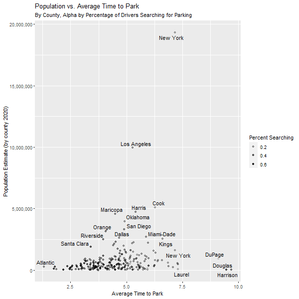
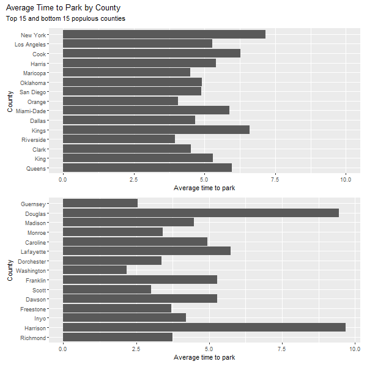
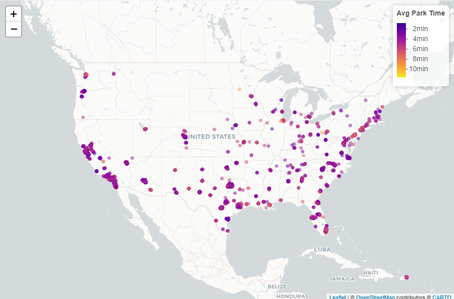
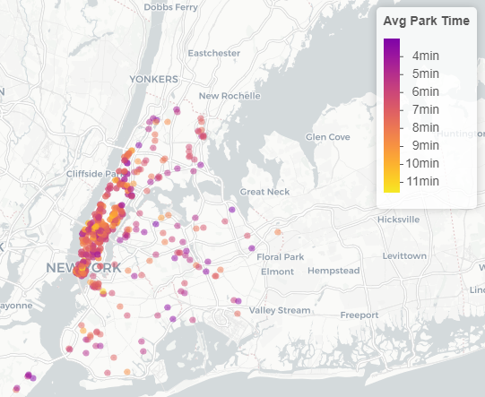

```{r setup, include=FALSE}
knitr::opts_chunk$set(echo = TRUE)
library(posterdown)
```

# Motivation / Background

- Owning a vehicle comes with many nuisances. Those who are moving into new cities will have to take into account parking availability, commute times, costs of parking, and many other variables when deciding to have a car. We aim to provide some context this to this problem in order to guide car owners in their decision to own a vehicle in a new city.

- The data comes from Kaggle^1^, with 4751 observations that each describe a parking area in the United States, we find our main variables of interest:
  - AvgTimeToPark: The average time taken to search for parking (in minutes)
  - TotalSearching: The number of drivers searching for parking
  - PercentSearching: The percentage of drivers that were searching for parking
  - PercentCar: Percentage of vehicles with parking issues that were cars
- We combined this Kaggle^1^ dataset with a US Census Bureau dataset^2^ on population statistics from 2020 in order to gain further context for our analysis.
  
# Exploratory Data Analysis

- To start our process we began with some basic exploratory data analysis. To gain a better understanding of our EDA, please look through our Shiny App we created.

<center> {height=50%, width=70%}</center>

- This is a scatter plot of Population vs. Average time to park (minutes) by county. The alpha of the points is filled by our variable 'Percent Searching' (Percent of vehicle owners searching for parking in the county). We use this dot plot to clearly showcase the outlier counties.

<center>{height=40%, width=70%}</center>

- Here we have two bar plots. The first bar plot showcases the top 15 most populous counties as well as the nationwide average and their respective average time to park. The second histogram showcases the bottom 15 most populous counties as well as the nationwide average and their respective average time to park. 

<center>{height=60%, width=60%}</center>

- Our Kaggle dataset^1^ also came with Geohash boundaries as well as Latitude and Longitude coordinates for each parking area. We utilized this to create a Leaflet of all the parking areas. We can use this Leaflet to gain a closer look at different cities.

<center>{height=40%, width=50%}</center>

# Statistical Analysis

- Our goal is to explore the relationship between cities and parking time, evaluate variables that correlate to parking efficiency, and further assess the correlation between them. We also want to allow for a targeted root cause analysis through this visualization and derive a conclusion from it. The main explanatory variable used is coordinates (x,y), and the response variable is average parking time for each Geohash. Therefore, we decided to use Ordinary Kriging, which is a very popular approach to handle spatial data.
  - The expression of the model is simple: $Z(s)= \mu+\epsilon(s)$, where $Z(s)$ is the response variable, $s$ is the coordinate, $\mu$ is some constant, and $\epsilon(s)$ is the error term depending on the coordinate. In our case, $Z(s)$ is the average parking time.
  
- The key goal in Ordinary Kriging is to minimize the error variance. We can draw a heat map among states and or cities and have a glimpse of how hard it is to park in different areas.

<center>{height=80%, width=80%}</center>

- This is the map for Houston, Texas. With the Kriging method with a threshold of 0.7 you might be able to identify the most difficult area for parking. The coefficient is normalized, and deeper color means it is harder to park in this area. 

# References

1) Terence Shin (2020). Parking Statistics in North America [Dataset].     https://www.kaggle.com/terenceshin/searching-for-parking-statistics-in-north-america

2) United States, Census Bureau. (2010). 2010 Census Total Population by ZIP Code. Retrieved March 13, 2022, from https://data.census.gov/cedsci/table?q=Population%20Total&g=0100000US%248600000&tid=DECENNIALSF12010.P1


